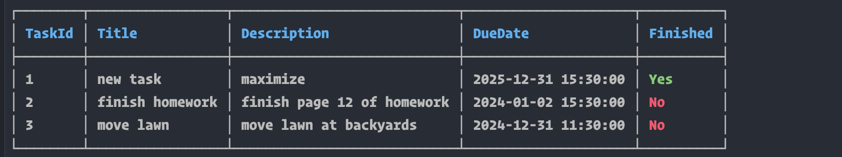
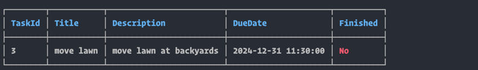

# Task Forger v0.1.0

Task Forger is a simple task manager for the command line. It is written in .NET Core. Uses SQLite for data storage.
And Cocona for the UI.

## Usage

### Add a task

```
tf add
```

### List tasks

```
tf list-all
```

### Complete a task

```
tf mark-finished <task-id>
```

### Delete a task

```
tf delete <task-id>
```

### List calendar view

```
tf calendar <year> <month>
```

### Filter tasks

```
tf list-filtered <filter>
```

### Update a task

```
tf update <title> <description> <due-date> <task-id>
```


## Example screenshots:

### List all tasks


### Calendar view


### Filtered view

